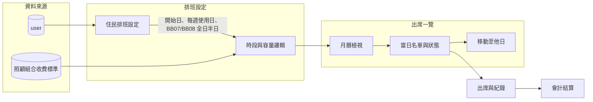

# 依排班條件之實作計畫

本計畫對應 [.cursor/plans/排班條件.md](.cursor/plans/排班條件.md) 所列條件，在現有 daycare 專案（Vue3 + Pinia + MariaDB、[router/index.js](src/router/index.js)、[useStore.js](src/stores/useStore.js)、[api.js](src/assets/js/api.js)）上，新增「出席一覽」月曆排班及相關資料與流程。

---

## 一、需求與規則整理

| 條件編號 | 要點     | 說明                                                                                |
| ---- | ------ | --------------------------------------------------------------------------------- |
| 1    | 時段與容量  | 當日分早上、下午；早上與下午**各**可放入 **28 人**                                                   |
| 2    | 服務型態   | 全日 或 半日                                                                           |
| 3    | 數量計算   | 僅「社區式服務類長期照顧服務收費標準表」有列之組合才算（見 [documents/照顧組合收費.md](documents/照顧組合收費.md)）         |
| 4    | 資料一覽   | 目前用 **照顧及專業服務 B**、**喘息服務 G**，之後可能 **SC**                                          |
| 5    | 病歷排班設定 | 開始日期（當天可排、指定日後才建構）、每週使用日；**BB08 每月**、**GA09 每年**；**BB07 / BB08 可同時存在全日與半日，需獨立設定** |
| 6    | 組數     | **僅當月用完**（當月額度、不可跨月）                                                              |
| 7    | 月曆展示   | 月曆顯示：上午人數、下午人數、有到人數；點日期看當日詳情；可記錄出席、生命徵象、用藥、進食、到機構時間                               |
| 8    | 改日     | 指定之人可**移動到另一天**（例如當日不行、隔天可）                                                       |
| 9    | 月曆操作   | 選單可調住民開始上課日；可依當月符合住民排課；可單排指定住民；點選日期顯示當日上課名單並可輸入狀態（建議 list 或表格式）                   |
| 10   | 功能歸屬   | 以上月曆模式即「**出席一覽**」功能                                                               |

備用：車趟 BB08 需記錄一個月使用幾次（車趟資訊）。

---

## 二、架構與資料流概念

- **user**：沿用既有 [User](src/views/main/User/index.vue) / `userFullData`，不變。
- **病歷排班設定**：需新增「住民排班設定」資料（見下節），與 user 以 `user_snkey` 關聯。
- **月曆與當日**：前端以「出席一覽」單一功能呈現，內含月曆、當日名單、移動、狀態輸入。
- **組數當月用完**：在排班／異動時檢查當月已用組數與額度，並與 [客戶需求理解：資料匯入至會計結算](.cursor/plans/客戶需求理解：資料匯入至會計結算_d70ed251.plan.md) 之「排出每日班別 → 會計結算」銜接。

---

## 三、資料模型建議

專案目前以 `api.get('user')`、`general/addMulti` 等與後端通訊，表結構需在後端（MariaDB）實作；以下為前端需對接之概念結構。

### 3.1 住民排班設定（新表，以 user_snkey 連結）

- **開始日期**：**直接記錄在病歷**（user 的 datalist 或既有病歷欄位），不放在本新表。
- 排班設定採**新建一張表**記錄，與 user 以 `user_snkey` 關聯。

**新表必備記錄欄位：**

| 欄位              | 說明                                                                             |
| --------------- | ------------------------------------------------------------------------------ |
| `user_snkey`    | 關聯 [user](src/views/main/User/index.vue)                                       |
| `月份`            | 適用月份（或起始月份，依業務決定為單月或區間）                                                        |
| `schedule_type` | 照顧組合代碼（如 BB07、BB08、GA09 等，對應收費表）                                               |
| `weekdays`      | 每週使用日（如 1,2,3,4,5 表示週一～五）                                                      |
| `quota_type`    | 配額型態（如 month 每月 / year 每年）                                                     |
| **全日／半日**       | 需明確記錄該筆 `schedule_type` 為**全日**或**半日**項目（建議獨立欄位，例如 `day_type` 或 `is_full_day`） |

同一住民可有多筆設定（例如 BB07 全日 + BB08 半日 並存），每筆皆獨立儲存。

### 3.2 排班／出席紀錄

- **排班表**：日期 + 上午/下午 + 住民 `user_snkey` + 服務型態（全日/半日）+ 照顧組合代碼（B/G/SC 對應收費表）。
- **當日人數**：依「日期 + 上午」、「日期 + 下午」分別統計，且不超過 28 人。
- **組數**：依收費標準表與「當月」使用量計算，組數僅當月有效。

### 3.3 當日狀態與紀錄

每筆「某日 + 某住民」可存：

- 出席與否、到機構時間。
- **生命徵象**：體溫、脈搏、血壓、血氧、呼吸——**僅建在當日資料（當日紀錄表）即可**，與 [SignLifeMulti](src/views/main/SignLifeMulti/index.vue) **無需關聯**，欄位自訂（如 temperature、pulse、bp_h/bp_l、blood_oxygen、breath）。
- 是否吃藥、是否進食。

可為「排班紀錄」的延伸欄位或另表「當日紀錄」，以 date + user_snkey 為鍵。

### 3.4 車趟（備用）

- BB08 車趟：建議欄位記錄「當月使用次數」或「當月車趟次數」，與排班表或住民設定關聯，供日後擴充。

---

## 四、功能實作要項

### 4.1 病歷管理擴充（條件 5）— **優先實作**

- **開始日期**：**直接記錄在病歷**（user 的 datalist 或既有病歷欄位），可為當天可排或指定日後才建構；在病歷管理介面編輯與儲存。
- 以**新表**（見 3.1）儲存其餘排班設定，由 `user_snkey` 連結；新表**不存開始日期**。
- 在病歷管理或獨立「排班設定」介面可編輯並寫入新表：
  - **每週使用日**（勾選週一～週日）→ 對應欄位 `weekdays`。
  - **schedule_type**（對應收費表組合，如 BB07、BB08、GA09）、**quota_type**（每月/每年）、以及**該筆為全日或半日**；BB07/BB08 可同時存在全日與半日，每筆獨立一列。
- 前端表單需能區分「每月(BB08)」「每年(GA09)」及全日/半日並存，並只允許收費表有列之組合。

### 4.2 出席一覽（月曆模式）（條件 7、9、10）— **備用**

- **路由與選單**：新增路由（例如 `/main/AttendanceCalendar` 或 `/main/AttendanceList`），並在 [useStore.js](src/stores/useStore.js) 的 `authKeys` 新增「出席一覽」入口（可參考現有 activitylist、handoverlist 的寫法）。
- **月曆檢視**：
  - 以月曆形式顯示當月；每個日期格子顯示：**上午人數**、**下午人數**、**有到人數**（實際出席）。
  - 點選日期 → 進入當日詳情。
- **當日詳情**：
  - 顯示當日上課名單（依上午/下午、全日/半日列出）。
  - 可輸入/編輯：出席情況、到機構時間、生命徵象（體溫、脈搏、血壓、血氧、呼吸）、有無吃藥、有無進食。
  - 以 **list 或表格** 呈現名單與狀態（每列一住民、欄位對應上述項目），儲存時寫入排班／出席紀錄。
- **月曆操作選單**（條件 9）：
  - 調整住民**開始上課日期**（呼叫病歷排班設定之開始日）。
  - **依當月符合住民排課**：依開始日與每週使用日，自動產生當月建議排班（仍受上午/下午各 28 人與組數限制）。
  - **單排指定住民**：手動選擇住民與日期、上午/下午、全日/半日。
- **移動至他日**（條件 8）：在當日名單中，可將「指定住民」從 A 日改排到 B 日（例如改到隔天）；需檢查 B 日該時段是否未滿 28 人及組數。

### 4.3 容量與收費規則 — **備用**

- **上午/下午各 28 人**：在「排班」與「移動」時，檢查該日該時段已排人數，超過則不允許新增或移入。
- **僅收費表有的組合才算**：排班所選照顧組合需對應 [documents/照顧組合收費.md](documents/照顧組合收費.md)（B：BB01–BB14、G：GA03/GA04、SC：SC03/SC04 等），數量與計價僅採這些代碼。
- **組數當月用完**：計算每位住民當月已使用組數（依 B/G/SC 與收費表），排班或移動時不超過當月配額；若後端有配額表，需一併對接。

### 4.4 與既有模組銜接 — **備用**

- **user**：排班設定與排班表皆以 `user_snkey` 關聯，不改變現有 user 表結構，僅擴充「排班設定」與「排班/出席」表。
- **生命徵象**：僅存於當日紀錄表，與 SignLifeMulti 無需關聯；欄位可自訂（如 temperature、pulse、bp_h/bp_l、blood_oxygen、breath）。
- **會計結算**：排班結果（實際出席、使用的 B/G/SC）應可作為「每日班別」產出，與 [客戶需求理解：資料匯入至會計結算](.cursor/plans/客戶需求理解：資料匯入至會計結算_d70ed251.plan.md) 的「照會組表 → 帶入 → 審核 → 會計結算」對接（實作時由後端/API 提供「當月排班與出席彙總」給會計端）。

### 4.5 車趟 BB08 — **備用**

- 預留「車趟」資訊與「當月使用次數」欄位或表；介面可於出席一覽或住民排班設定中後續再加「車趟次數」的查詢/輸入。

---

## 五、實作順序建議

**本階段優先完成 4.1，其餘列為備用。**

1. **後端**：建立「住民排班設定」新表（含 user_snkey、月份、schedule_type、weekdays、quota_type、全日/半日欄位）及對應 API（get/add/update/delete）。
2. **4.1 病歷管理擴充**：前端表單與新表 API 對接，完成開始日、每週使用日、schedule_type（含全日/半日）、quota_type 之編輯與儲存；僅允許收費表有列之組合。
3. **以下為備用，待 4.1 完成後再進行**：排班/出席表與當日狀態紀錄、出席一覽月曆、當日詳情、排班操作、移動至他日、容量與組數檢查、會計銜接、車趟 BB08。

---

## 六、與現有程式碼的對應

- **路由**：[src/router/index.js](src/router/index.js) 在 `main` 的 children 新增一筆「出席一覽」路由。
- **主選單**：[src/stores/useStore.js](src/stores/useStore.js) 的 `authKeys` 新增一項（label、route、authKey、icon），若沿用現有權限則 `authKey` 可為 `pass`。
- **API**：沿用 [src/assets/js/api.js](src/assets/js/api.js) 的 `get`、`add`、`post`、`addMulti` 等，後端需提供對應 table 名稱與參數。
- **收費標準**：前端可將 [documents/照顧組合收費.md](documents/照顧組合收費.md) 內 B/G/SC 代碼整理成常數或設定檔，供下拉選單與驗證使用。

---

## 七、小結

本計畫依 [.cursor/plans/排班條件.md](.cursor/plans/排班條件.md) 將「出席一覽」月曆排班拆成：**病歷排班設定**（開始日、每週使用日、BB07/BB08 全日半日獨立）、**月曆顯示與當日名單**、**當日狀態紀錄**（出席、生命徵象、用藥、進食、到機構時間）、**排班與改日**（含 28 人與組數當月用完）、以及與 **收費標準表 B/G/SC** 及 **會計結算** 的銜接；車趟 BB08 列為備用擴充。實作時需先與後端確認表結構與 API，再依上列順序分階段開發前端。